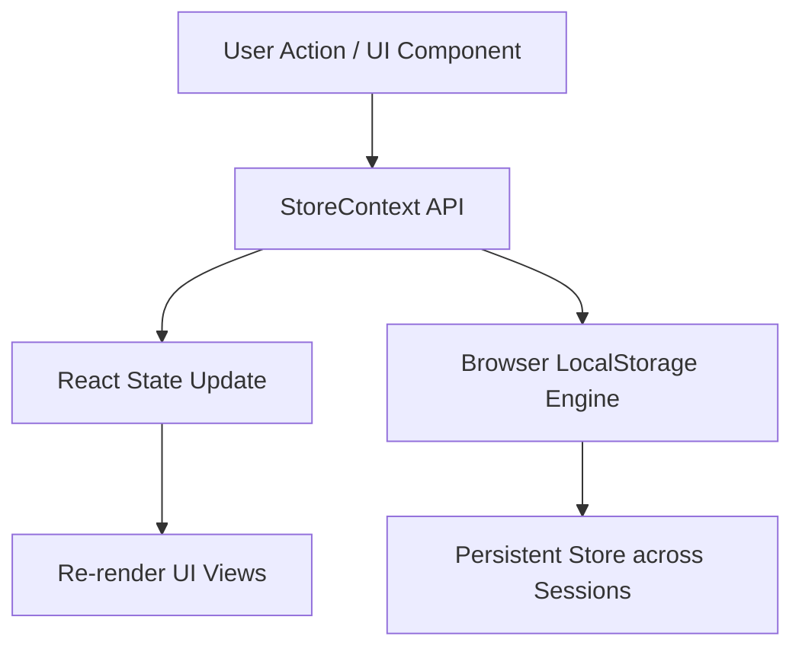

<div align="center">

# 🧸 Teddy Haven — Premium 3D E-Commerce Experience

[](https://react.dev/)
[](https://vitejs.dev/)
[](https://threejs.org/)
[](https://developer.mozilla.org/en-US/docs/Web/JavaScript)
[](LICENSE)
[](https://github.com/AKASH-KALSARIYA)

<p align="center">
  <b>A state-of-the-art single-page E-Commerce platform featuring 3D web graphics, speech synthesis, AI-powered widgets, and seamless client-side state persistence.</b>
</p>

[✨ Live Demo](#-quick-start) • [⚡ Features](#-key-features) • [🏗 Architecture](#-architecture--state-management) • [📁 Directory Structure](#-directory-structure) • [👤 Author & Governance](#-author--governance)

---

</div>

## 🌟 Executive Overview

**Teddy Haven** addresses a major limitation in traditional frontend ecommerce prototypes—the loss of state upon page refresh and lack of an end-to-end interactive journey. 

Designed and engineered by **Akash Kalsariya**, Teddy Haven provides a realistic, immersive, and persistent shopping experience using advanced browser APIs, **Three.js** 3D visualizers, **Web Speech API**, and **React Context Persistence**.

---

## ⚡ Key Features

### 🎨 1. Immersive 3D & Interactive Visuals
- **3D Teddy Hologram**: Built using **Three.js** with real-time canvas rendering and particle lighting effects on the Welcome landing.
- **Voice Assistance & Speech Synthesis**: Integrated Hindi/English voice welcome message using Web Speech API.
- **AR Preview Modal**: Augmented reality product display simulation.
- **Glassmorphic UI**: Vibrant gradient accents, micro-animations, dynamic cards, and customizable dark/light themes.

### 🛒 2. Complete E-Commerce Workflow
- **Product Catalog & Quick View**: Filter products by categories, price, mood tags, and instant search.
- **Interactive Customizer**: Personalize teddy bears with custom photos, colors, and gift wrappers.
- **Cart & Wishlist Management**: Slide-out cart drawers, quick quantity adjusters, and wishlist panels.
- **3-Step Checkout Stepper**: Shipping Address $\rightarrow$ Payment Gateway (Card/UPI simulation) $\rightarrow$ Order Confirmation.
- **Order History & Account Dashboard**: View live order statuses, reorder past purchases, edit profiles, and manage saved delivery addresses.

### 🔒 3. Zero-Backend Client Persistence
- **LocalStorage Data Layer**: Cart, Wishlist, User Profiles, Addresses, and Orders automatically synchronize with `localStorage`.
- **Fault-Tolerant State**: Safe JSON parsing utility prevents data corruption upon invalid browser storage states.

---

## 🏗 Architecture & State Management

All application logic flows through a centralized global store built with **React Context** (`StoreContext.jsx`).



### Tech Stack Breakdown

| Layer | Technology / Library | Purpose |
| :--- | :--- | :--- |
| **UI Library** | `React 18.3` | Modular component hierarchy & hooks |
| **Build System** | `Vite 5.1` | Ultra-fast HMR and bundle optimizer |
| **Routing** | `React Router 6` (`HashRouter`) | Client-side page navigation |
| **3D Engine** | `Three.js` | Interactive 3D Hologram canvas |
| **Styling** | Vanilla CSS3 + Flexbox/Grid | Custom design system & animations |
| **Persistence** | Web Storage API (`localStorage`) | Full client-side data persistence |
| **Icons & Fonts** | FontAwesome 6 + Google Fonts | Typography & icon aesthetics |

---

## 📁 Directory Structure

```text
teddy-e-commerce/
├── public/
│   └── toddy/               # High-res product images & avif assets
├── src/
│   ├── components/          # Reusable UI Widgets & Modals
│   │   ├── ArPreviewModal.jsx        # AR visualization dialog
│   │   ├── CartModal.jsx             # Slide-out shopping cart
│   │   ├── ChatWidget.jsx            # Customer support bot
│   │   ├── ComparePanel.jsx          # Product comparison drawer
│   │   ├── CustomizerWidget.jsx       # Custom bear builder
│   │   ├── Footer.jsx                # Dynamic footer & interactive policy modals
│   │   ├── Header.jsx                # Top navigation & search bar
│   │   ├── QuickViewModal.jsx        # Fast product details preview
│   │   ├── UserPopup.jsx             # Auth & user account popup
│   │   ├── VoiceSearchWidget.jsx     # Voice recognition widget
│   │   └── WishlistModal.jsx         # Saved items drawer
│   ├── context/
│   │   └── StoreContext.jsx          # Global state & persistence layer
│   ├── data/
│   │   └── products.js               # Static product catalog data
│   ├── pages/
│   │   ├── Welcome.jsx               # 3D landing screen
│   │   ├── Home.jsx                  # Main store grid & filters
│   │   ├── ProductDetail.jsx         # Individual product view
│   │   ├── Checkout.jsx              # Stepper checkout & payment
│   │   ├── OrderHistory.jsx          # Account dashboard & orders
│   │   └── ThankYou.jsx              # Order confirmation view
│   ├── styles/                       # Modular CSS stylesheets
│   ├── App.jsx                       # Provider wrapper & routes definition
│   └── main.jsx                      # React DOM entry point
├── index.html                        # HTML template & FontAwesome scripts
├── package.json                      # Project dependencies & scripts
└── README.md                         # Documentation
```

---

## 🚀 Quick Start & Setup

Follow these simple steps to run **Teddy Haven** locally:

### 1. Clone the Repository
```bash
git clone https://github.com/AKASH-KALSARIYA/teddy-e-commerce.git
cd teddy-e-commerce
```

### 2. Install Dependencies
```bash
npm install
```

### 3. Launch Development Server
```bash
npm run dev
```
Open your browser and navigate to `http://localhost:5173` (or the URL displayed in your terminal).

### 4. Build for Production
```bash
npm run build
```

---

## 🛡️ Author & Governance

This project is proudly created, developed, and maintained by **Akash Kalsariya**.

- **Founder & Lead Developer**: Akash Kalsariya
- **GitHub**: [@AKASH-KALSARIYA](https://github.com/AKASH-KALSARIYA)
- **Contact Email**: akashkalsariya@gmail.com
- **Support Contact**: +91 9879331257

---

<div align="center">

  **Crafted with ❤️ and Passion By Akash Kalsariya**

  © 2026 Teddy Haven. All Rights Reserved.

</div>